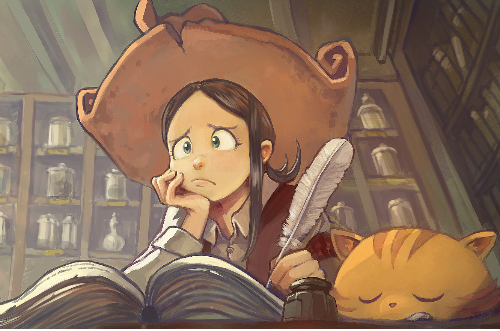
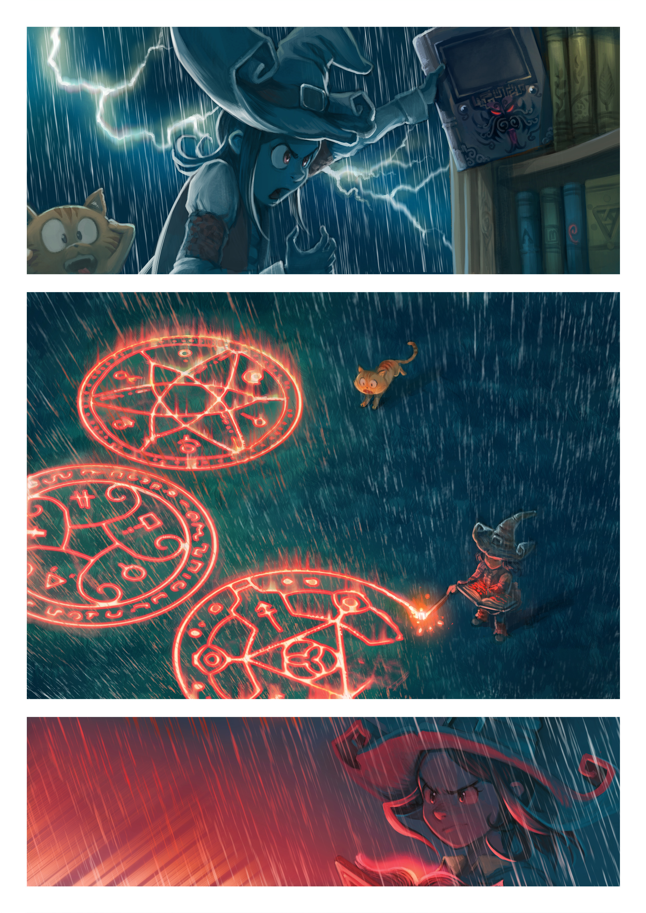
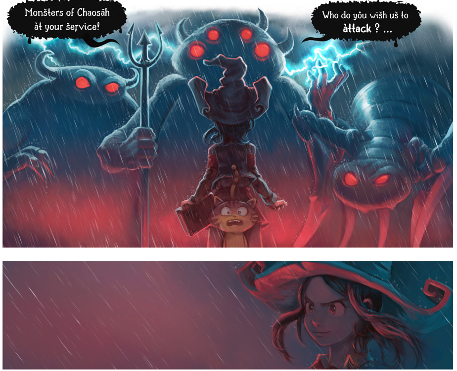

:title: Introduction to Scheme / Guile / Racket
:author: Craig Maloney
:css: presentation.css

.. title:: Introduction to Scheme / Guile / Racket
 
----

Introduction to Scheme, Guile, and Racket
=========================================

* Author: Craig Maloney
* Email: craig@decafbad.net
* Website: http://decafbad.net

----

Three Types of Folks...
=======================

----

----

----

----

Our story begins...
===================

----

Learning JavaScript...
======================

----

----

But somewhere I heard that JavaScript borrowed from Scheme...
=============================================================

----

So naturally...
===============

----

----

But it's not as orthogonal as you might imagine...
==================================================

----

::

    JavaScript’s C-like syntax, including curly braces and the clunky
    for statement, makes it appear to be an ordinary procedural
    language. This is misleading because JavaScript has more in 
    common with functional languages like Lisp or Scheme
    than with C or Java.

**Douglas Crockford "Javascript, the Good Parts"**

::

    http://journal.stuffwithstuff.com/2013/07/18/javascript-isnt-scheme/

----

So why play with Scheme?
========================

----

----

----

But really...
=============

.. image:: images/pepper_tea.png
   :width: 800px

----

What we'll cover
================

* A brief history of Scheme
* Basic Scheme syntax
* Guile (GNU Scheme)
* Racket (DrRacket)

----

What's a Scheme?
================

* Created by Guy L. Steele and Gerald Jay Sussman

* Scheme is one of the main dialects of LISP

* Development is documented in "The Lambda Papers"

  * (1975-1980)
* Has had many standardization efforts

  * R5RS (1998)

  * R6RS (2007)
    
  * R7RS (2013)

----

Alas:
=====

Alas: Scheme has the unhappy distinction of being the world's most unportable programming language. It is almost misleading to call Scheme a "programming language;" it would be more accurate to characterise Scheme as a family of dialects, all loosely related by the common features of lexical scope, dynamic typing, list structure, higher-order functions, proper tail-recursion, garbage collection, macros, and (some form of) s-expression based lexical syntax.

::

    http://www.scheme-reports.org/2009/position-statement.html
    http://ur1.ca/r1dgx

----

Starting simple
===============

----

A Few Basic Datatypes
=====================

Atoms:

* 2
* 4.2
* "Hello World"
* #f
* a

----

Lists:

* ``(list 3 4 5)``
* ``'(3 4 5)``
* ``(cons 3 (cons 4 (cons 5 '())))``

----

Datatypes:

* ``(string? "quack")  => #t``
* ``(symbol? 'quack)  => #t``
* ``(string? 'quack)  => #f``

* ``(number? 42)  => #t``
* ``(number? 4.2)  => #t``
* ``(number? 1+1i)  => #t``
* ``(real? 1+1i)  => #f``

----

Datatypes (cont.):

* ``(real? 2/3)  => #t``
* ``(exact? 2/3)  => #t``
* ``(exact? 2.0)  => #f``
* ``(integer? 2.0)  => #t``
* ``(exact? (/ 4.0 2.0))  => #f``
* ``(integer? (/ 4.0 2.0))  => #t``

----

Quick note on symbols / strings
===============================

Symbols are "interned", so there is only one copy stored of a particular symbol:

* ``(define foo 'quack)``
* ``(define bar 'quack)``
* ``(eq? foo bar)  => #t``

* ``(define foo "quack")``
* ``(define bar "quack")``
* ``(eq? foo bar)  => #f``

----

Um, OK...
=========

----

Arithmetic Operators
====================

* ``(+ 1 2)``  => 3
* ``(- 1 3)``  => -2
* ``(* 3 2)``  => 6
* ``(/ 2 3)``  => 2/3

----

More Arithmetic Operators
=========================

* ``(+ 4 5 6 7 8)``  => 30
* ``(- 4 (* 6 5))``  => -26
* ``(/ 2 3 5)``  => 2/15
* ``(* 8 8 8)`` => 512

----

Variables
=========

* ``(define two 2)``
* ``(+ two two)``  => 4
* ``(define two 3)``
* ``(+ two two)``  => 6

----

More Variables
==============

* ``(define two (+ 1 1))``
* ``(define four (+ two two))``
* ``four``  => 4
* ``(define eight (* four two))``
* ``eight``  => 8

----

Latent typing
=============
* ``(define duck 4)``
* ``(number? duck)  => #t``
* ``(set! duck 'quack)``
* ``(number? duck)  => #f``

----

Those are some nice parlour tricks...
=====================================

----

Built-in functions
==================

* ``(number? 4)``  => #t
* ``(number? 'moo)``  => #f
* ``(symbol? 'moo)``  => #t
* ``(symbol? 4)``  => #f
* ``(string? "Hello, I am a string")``  => #t
* ``(null? '())``  => #t
* ``(list? '())``  => #t

----

Simple procedure (function)  for computing n^2
==============================================

* ``(define (square x) (* x x))``
* ``(define square (lambda(x) (* x x)))``

----

Pythagorean Theorem in Scheme
=============================

(Remember: a^2 + b^2 = c^2)

* ``(+ (square 5) (square 6))``

----

Procedures are variables
========================

::

    scheme@(guile-user)> (define (foo x) x)
    scheme@(guile-user)> ,tr (foo 4)
    trace: |  (#<procedure 1cf50e0> #(#<directory (guile-user) 1434c60> #f))
    trace: |  #(#<directory (guile-user) 1434c60> foo)
    trace: (#<procedure 1cff540 at <current input>:4:0 ()>)
    trace: (foo 4)
    trace: 4

    scheme@(guile-user)> (define bar foo)
    scheme@(guile-user)> ,tr (bar 5)
    trace: |  (#<procedure 1d33580> #(#<directory (guile-user) 1434c60> #f))
    trace: |  #(#<directory (guile-user) 1434c60> bar)
    trace: (#<procedure 1d41980 at <current input>:5:0 ()>)
    trace: (foo 5)
    trace: 5
    scheme@(guile-user)>

----

Procedures are variables
========================

::

    scheme@(guile-user)> (define (foo x) (display "I refuse"))
    scheme@(guile-user)> ,tr (bar 4)
    trace: |  (#<procedure 1d7b100> #(#<directory (guile-user) 1434c60> #f))
    trace: |  #(#<directory (guile-user) 1434c60> bar)
    trace: (#<procedure 1d85560 at <current input>:6:0 ()>)
    trace: (foo 4)
    trace: 4
    scheme@(guile-user)> ,tr (foo 4)
    trace: |  (#<procedure 1da7d60> #(#<directory (guile-user) 1434c60> #f))
    trace: |  #(#<directory (guile-user) 1434c60> foo)
    trace: (#<procedure 1dad240 at <current input>:6:0 ()>)
    trace: (foo 4)
    trace: (display "I refuse")
    I refusetrace: #<unspecified>
    scheme@(guile-user)>

----

Conditionals
============

::

    (if (zero? 0)
      (display "True\n")
      (display "False\n"))

    => True

----

Another Conditional
===================

::

    (cond 
      ((zero? 0) (display "True\n"))
      ((not (zero? 1)) (display "Also True\n")))

    => True

----

Equality
========

* ``eq?`` => Return #t if x and y are the same object, except for numbers and characters.

  * ``(define foo 5)``
  * ``(define bar foo)``
  * ``(eq? foo bar)  => #t``
  * ``(eq? foo 5)  => #t``

  * ``(define foo "5")``
  * ``(define bar "5")``
  * ``(eq? foo bar)  => #f``

----

Equality (cont.)
================

* ``equal?`` => Return #t if x and y are the same type, and their contents or value are equal.

  * ``(define foo "5")``
  * ``(define bar "5")``
  * ``(equal? foo bar)  => #t``
  * ``(string=? foo bar)  => #t``

  * ``(define foo '(3 4 5)``
  * ``(define bar '(3 4 5)``
  * ``(equal? foo bar)  =>  #t``
  * ``(eq? foo bar)  => #f``

----

Fibonacci Sequence
==================

::

  (define (fib n)
    (cond
      ((= n 0) 0)
      ((= n 1) 1)
      (else
        (+ (fib (- n 1))
           (fib (- n 2))))))

    scheme@(guile-user) [2]> (fib 30)
    $3 = 832040
           
----

Local Variables / Environment
=============================

* Each procedure can have its own local environment
* We can create local variables with ``let``

----

::

    (define s 42)

    (define false-answer
      (lambda ()
        (let ((s #f))
          (display s))))

    (false-answer)  => #f

    (display s)  => 42

----

Closures
========

::

    (define counter
      (let ((count 0)) 
        (lambda (x) 
          (set! count (+ x count))
          count)))

    scheme@(guile-user)> (counter 4)
    $1 = 4
    scheme@(guile-user)> (counter 4)
    $2 = 8
    scheme@(guile-user)> (counter 4)
    $3 = 12
    scheme@(guile-user)> 

----

.. image:: images/taste.jpg
   :width: 500px

----

Implementations...
==================

----

Guile
=====

----

Guile
=====

* Part of the GNU Project
* GNU Ubiquitous Intelligent Language for Extensions
   
----
