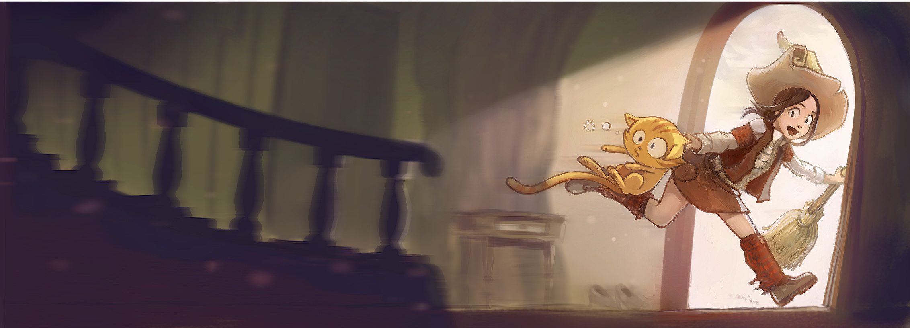

:title: Introduction to Scheme / Guile / Racket
:author: Craig Maloney
:css: presentation.css

.. title:: Introduction to Scheme / Guile / Racket
 
----

Introduction to Scheme / Guile / Racket
=======================================

* Author: Craig Maloney
* Email: craig@decafbad.net
* Website: http://decafbad.net

----

Our story begins
================

----

Learning JavaScript...
======================

----

.. image:: images/pepper_studying.png
   :width: 800px

----

So naturally...
===============

----

----

But it's not as orthogonal as you might imagine...
==================================================

----

JavaScript’s C-like syntax, including curly braces and the clunky for statement, makes it appear to be an ordinary procedural language. This is misleading because JavaScript has more in common with functional languages like Lisp or Scheme than with C or Java.

**Douglas Crockford "Javascript, the Good Parts"**

----

::

    http://journal.stuffwithstuff.com/2013/07/18/javascript-isnt-scheme/

----

So why play with Scheme?
========================

----

----

But really...
=============

.. image:: images/pepper_tea.png
   :width: 800px

----

What we'll cover
================

* A brief history of Scheme
* Basic Scheme syntax
* Guile
* Racket (DrRacket)

----

What's a Scheme?
================

* Created by Guy L. Steele and Gerald Jay Sussman

* Scheme is one of the main dialects of LISP

* Development is documented in "The Lambda Papers"

  * (1975-1980)
* Has had many standardization efforts

  * R5RS (1998)

  * R6RS (2007)
    
  * R7RS (2013)

----

Alas:
=====

Alas: Scheme has the unhappy distinction of being the world's most unportable programming language. It is almost misleading to call Scheme a "programming language;" it would be more accurate to characterise Scheme as a family of dialects, all loosely related by the common features of lexical scope, dynamic typing, list structure, higher-order functions, proper tail-recursion, garbage collection, macros, and (some form of) s-expression based lexical syntax.

::

    http://www.scheme-reports.org/2009/position-statement.html
    http://ur1.ca/r1dgx

----

Starting simple
===============

----

A Few Basic Datatypes
=====================

Atoms:

* 2
* 4.2
* "Hello World"
* #f
* a

----

Lists:

* (list 3 4 5)
* '(3 4 5)
* (cons 3 (cons 4 (cons 5 '())))
